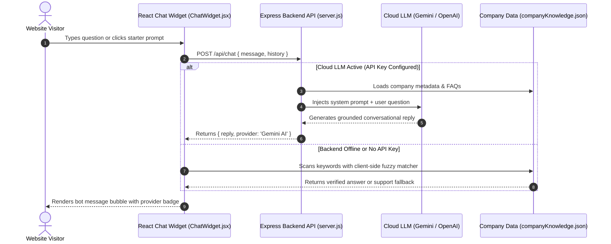

# Master Guide: Implementing a Company Q&A Chatbot in React

This guide explains how to add, configure, and customize an intelligent **Company Q&A Chatbot** in a React application. It includes step-by-step instructions on feeding accurate company data, embedding the UI widget, and connecting it either with an **Instant Zero-Backend Engine** or a **Cloud LLM (Gemini / OpenAI)**.

---

## 1. How It Works (Architecture Overview)



### Key Architectural Strengths
- **100% Factual & Grounded**: The bot only provides answers sourced directly from your company knowledge file.
- **Zero Hallucination Risk**: If a visitor asks about something outside your company data, it gracefully directs them to your official phone number and email.
- **Dual Operating Modes**:
  1. **Mode 1 (Instant / Zero-Backend)**: Runs directly in the browser using client-side fuzzy matching. Free, instant, zero latency, no API keys needed.
  2. **Mode 2 (Cloud LLM / Gemini / OpenAI)**: Passes the user query and `companyKnowledge.json` into Google Gemini or OpenAI via the included `backend/server.js`.

---

## 2. How to Add & Update Company Data (Giving Accurate Info)

All company knowledge is centrally stored in a single, easy-to-edit JSON file:
📍 **File Location:** `frontend/src/data/companyKnowledge.json`

### JSON Schema & Example

```json
{
  "company": {
    "name": "Anytime Diesel",
    "tagline": "Doorstep Diesel Delivery Anytime, Anywhere!",
    "founderAndCEO": "Rahul Reddy Kovvuri",
    "phone": "+91 94944 55555",
    "email": "info@anytimediesel.com",
    "address": "Flat No G1 PL no 246 255, Fortune Residency Kavuri Hills, Madhapur, Hyderabad - 500081",
    "operatingHours": "24 Hours a Day, 7 Days a Week (24×7)"
  },
  "serviceAreas": [
    "Hyderabad & Secunderabad",
    "Bengaluru Urban & Rural",
    "Chennai & Sriperumbudur",
    "Mumbai & Navi Mumbai",
    "Pune & Chakan Industrial Belt",
    "Delhi NCR & Gurugram"
  ],
  "faqList": [
    {
      "id": "how-to-order",
      "question": "How do I place an order for diesel?",
      "keywords": ["how to order", "order", "place order", "buy", "book", "delivery process", "steps"],
      "answer": "You can order diesel in 3 easy ways:\n1. **Mobile App**: Download the Anytime Diesel app on Google Play or Apple App Store.\n2. **Call 24/7 Hotline**: Dial **+91 94944 55555**.\n3. **Online Website**: Fill out the fuel requisition form on our homepage."
    },
    {
      "id": "pricing",
      "question": "What are your diesel prices?",
      "keywords": ["price", "cost", "rate", "markup", "expensive", "charges", "station", "pump price"],
      "answer": "Our diesel prices match the official daily retail fuel station price in your locality! We do not charge hidden markups. Deliveries are measured using PESO-calibrated digital flow meters."
    },
    {
      "id": "compliance-safety",
      "question": "Is doorstep diesel delivery legal and PESO compliant?",
      "keywords": ["peso", "safety", "certified", "iso", "compliance", "legal", "hazard"],
      "answer": "Yes, 100%! All Anytime Diesel mobile refuelers and Smart Fuel Cubes are fully licensed and approved by PESO (Petroleum and Explosives Safety Organization) and ISO 9001:2015 certified."
    }
  ]
}
```

### Best Practices for Accurate Company Data
1. **Rich Keywords**: Add synonyms to the `keywords` array (e.g. `["order", "buy", "how to get", "delivery"]`).
2. **Clear Formatting**: Use Markdown in the `answer` string (`**bold**`, bullet points `\n• item`, numbered lists `\n1. item`).
3. **Contact Details**: Keep your phone number and email up-to-date in the `"company"` block so the fallback response always points to active channels.

---

## 3. How to Implement the Chatbot in React

### Step 3.1: File Structure

```
├── docker-compose.yml         # Runs Frontend (Port 5173) + Backend (Port 3001)
├── backend/
│   ├── server.js              # Express API with Gemini & OpenAI handlers
│   ├── Dockerfile
│   └── .env                   # Add your GEMINI_API_KEY or OPENAI_API_KEY here
└── frontend/
    ├── src/
    │   ├── components/
    │   │   └── Chatbot/
    │   │       ├── ChatWidget.jsx     # Floating button & expandable chat window
    │   │       └── chatKnowledge.js   # Fast client-side query matching logic
    │   └── data/
    │       └── companyKnowledge.json  # Your company knowledge base
    └── vite.config.js         # Proxies /api to backend:3001
```

### Step 3.2: Mount the Chatbot in Your App

In `src/App.jsx` (or your root layout), simply import and place `<ChatWidget />`:

```jsx
import React from 'react';
import ChatWidget from './components/Chatbot/ChatWidget';

export default function App() {
  return (
    <div className="min-h-screen bg-black text-white">
      {/* Your Navbar, Hero, and Page Content */}

      {/* Floating 24/7 Chatbot Widget */}
      <ChatWidget />
    </div>
  );
}
```

---

## 4. Connecting to a Cloud LLM (Gemini / OpenAI Backend)

The full-stack backend is already implemented in `backend/server.js` and wired to Docker Compose.

### Step 1: Set Your API Key
Open `backend/.env` (or pass it in your environment) and add your key:

```env
PORT=3001

# Google Gemini API Key (Recommended: Gemini 2.5 Flash)
GEMINI_API_KEY=AIzaSy...your_gemini_api_key_here

# Or OpenAI API Key (Alternative: GPT-4o Mini)
# OPENAI_API_KEY=sk-...your_openai_key_here
```

### Step 2: Start the Full-Stack Application
```bash
docker compose up --build
```

- **Frontend**: Accessible at [http://localhost:5173](http://localhost:5173)
- **Backend API**: Accessible at [http://localhost:3001/api/health](http://localhost:3001/api/health)

---

## 5. Testing & Verification Checklist

To verify that your chatbot is working properly and providing accurate information:

| Test Query | Expected Bot Response |
| :--- | :--- |
| **"Who is the founder of Anytime Diesel?"** | Returns **Rahul Reddy Kovvuri** and company background. |
| **"How do I order diesel?"** | Provides the 3 ordering steps (App, Phone +91 9494455555, Web form). |
| **"What are your prices?"** | Confirms prices match official local petrol pump rates with no hidden markups. |
| **"Is it PESO approved?"** | Confirms 100% PESO license and ISO 9001:2015 certification. |
| **"What cities do you deliver to?"** | Lists Hyderabad, Bangalore, Chennai, Mumbai, Pune, Delhi NCR, Vizag. |
| **"What is the ATD Fuel Cube?"** | Explains automated on-site storage tanks (500L - 10,000L) with IoT telemetry. |
| **"Can you book a train ticket?"** (Out of domain) | Gracefully falls back to official company phone (+91 9494455555) and email. |

---

## 6. Summary

- **To change company info:** Edit [companyKnowledge.json](file:///mnt/NewVolume/Github/2026/Test/hareeshwar/frontend/src/data/companyKnowledge.json).
- **To add your Gemini/OpenAI API key:** Edit [backend/.env](file:///mnt/NewVolume/Github/2026/Test/hareeshwar/backend/.env).
- **To launch full stack:** Run `docker compose up --build`.
